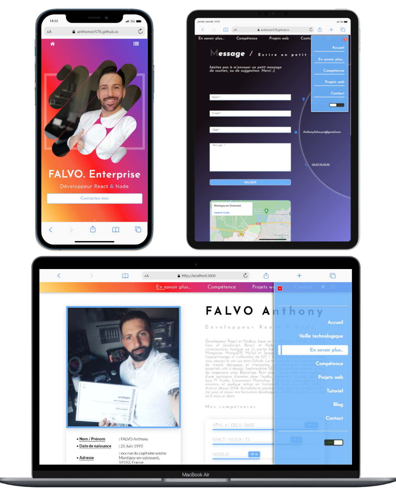

# FALVO ENTERPRISE

## MY WEB SITE : 

## Présentation :

En cours de réalisation. Il s'agit de la mise à jour d'un site crée il y a 1 an.

## Librairies : 
- EmailJS (contact par e-mail)
- SweetAlert (alerte personnalisée)
- React Icons (icône directement via react)
- React copy to clipboard (copier coller)
- React terminal (terminal personnalisé)
- Swiper (carousel)
- React-menu (menu react)

## Version : 

- Version 0.0.1   : 03 Mars     2021
- Version 0.0.2   : 24 Décembre 2021
- Version 0.0.3   : 27 Décembre 2021 [ Application fonctionnelle      ]
- Version 0.0.4   : 07 Janvier  2022 [ Amélioration navigation        ]
- Version 0.0.5   : 08 Janvier  2022 [ Ajout dark mode button         ] 
- Version 0.0.6   : 23 Janvier  2022 [ Ajout Terminal (bêta)          ]
- Version 0.0.7   : 05 Fevrier  2022 [ Terminal ok    (bêta)          ]  
- Version 0.0.8   : 13 Mars     2022 [ Conversion TS ok               ]
- Version 0.0.85  : 09 Avril    2022 [ MAJ Menu                       ]    